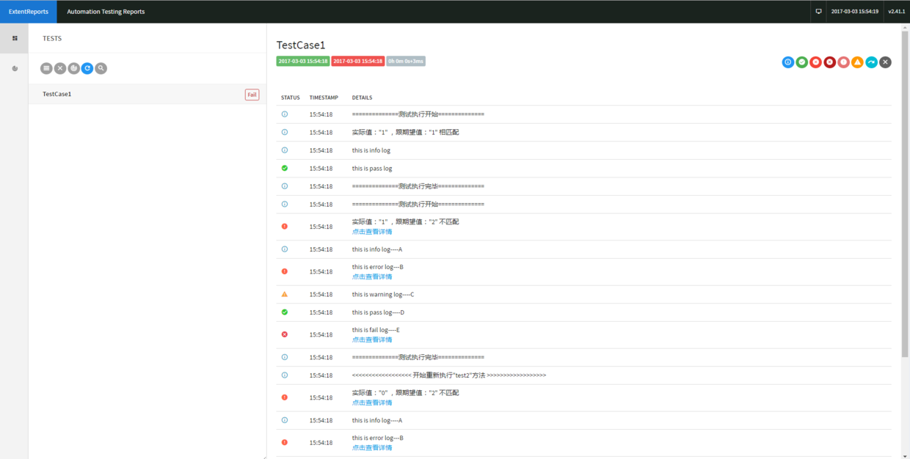

# Log4Reports
### 框架说明（Description）：
It's a framework of automation testing log and report

框架详情及使用方式可以参考博客(more details)：http://www.jianshu.com/p/2c3fd46e2357

1、框架详情及使用方式可以参考博客(more details)：http://www.jianshu.com/p/2c3fd46e2357

2、框架jar包：

version 1.0.0： <a href="https://pan.baidu.com/s/1i4Eq0SX">Log4Reports_1.0.0.jar</a>


### 使用示例（Demo）：
###### 1> 创建测试类继承Log4Reports框架的BaseCase类，并实现initConfig()方法：
```
public class TestCase1 extends **BaseCase** {
    ……
    //实现BaseCase的initConfig()方法
    @Override
    public void initConfig() {
        // TODO Auto-generated method stub
        logConfig = new LogConfig.Builder("\\\\127.0.0.1\\SharedFolder") //设置共享目录
        .setLogType(0)      //设置日志类型
        .setRetryTimes(1) //设置失败重跑次数
        .setSmtpHost("smtp.163.com") //设置发送邮箱的smtp host
        .setSender("automation@163.com") //设置发送邮箱的账号
        .setSendPassword("123456) //设置发送邮箱的账号密码
        .setReceivers("alany@xx.com;alany2@xx.com") //邮件接收者账号，多个账号用分号隔开
        .setSubject("Test Log4Reports") //邮件主题
        .build();
        System.out.println("init log config finished.");
    }
}
```
###### 2> 如果需要使用TestNG的@BeforeClass（BaseCase中使用的注解包括：@BeforeSuite、@AfterSuite、@BeforeClass、@AfterClass、@BeforeMethod、@AfterMethod 这6个）等注解时，需要覆写这些方法时先调用父类对应方法：
```
    @BeforeClass
    public void beforeClass() {
        super.beforeClass();
        /** 下面实现你自己的逻辑 **/
    }
        @AfterClass
    public void afterClass(){
        super.afterClass();
        /** 下面实现你自己的逻辑 **/
    }
    @AfterMethod
    public void afterMethod(ITestResult result) {
        super.afterMethod(result);
        /** 下面实现你自己的逻辑 **/
    }

    /** 不是上述的6个注解，不用调用父类的方法 **/
```        
###### 3>使用@Test注解编写测试方法：
```
public class TestCase1 extends BaseCase{
    private int flag = 0;

    @BeforeClass
    public void beforeClass() {
        super.beforeClass();
        flag = 1;
    }

    @AfterMethod
    public void afterMethod(ITestResult result) {
        super.afterMethod(result);
        flag = flag >1 ? 1 : flag;
    }

    @Test
    public void test(){
        if(assertEquals(flag, 1, true)){
            flag ++;
        }
        Log.info("this is info log");
        Log.pass("this is pass log");    
    }

    @Test
    public void test2(){
        if(assertEquals(flag, 2, true)){
            flag --;
        }
        Log.info("this is info log----A");
        Log.error("this is error log---B");
        Log.warn("this is warning log----C");
        Log.pass("this is pass log----D");
        Log.fail("this is fail log----E");
    }

    @Override
    public void initConfig() {
        // TODO Auto-generated method stub
        logConfig = new LogConfig.Builder("\\\\172.0.0.1\\SharedFolder")
        .setLogType(0)
        .setRetryTimes(1)
        .setSmtpHost("smtp.163.com")
        .setSender("automation@163.com")
        .setSendPassword("123456")
        .setReceivers("alany@XX.com")
        .setSubject("Test Log4Reports")
        .build();
        System.out.println("init log config finished.");
    }
}
```
### 效果（Show）：





